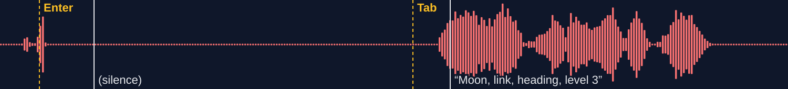
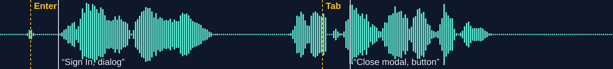

# Earshot: screen-reader tests for AI-written UI

  

IBM Bob fixes the UI, a real screen reader (NVDA, not a simulation) checks every fix by ear, and a two-layer gate (a git hook, plus a hook inside Bob) blocks any change that breaks what a blind user hears.
Tested on IBM's own Galaxium Travels sample app. Nothing was planted: the bugs are IBM's; the audit document is ours.

**Report page:** https://py-tr.github.io/earshot/ · **Video (3 min):** [VIDEO URL]

**Before** (IBM's app as shipped): Enter opens the Sign In dialog, and NVDA says nothing.



**After** Bob's fix, verified by ear: NVDA says "Sign In, dialog".



## For reviewers: where to check each claim

| Judging criterion | Claim | Check it here |
|---|---|---|
| Application of Technology: "complete and well thought-out, with a clear application of IBM Bob 2.0" | Bob fixes UI, verifies each fix with a real screen reader through our MCP tool, rejects its own wrong fixes, discovers bugs with parallel subagents, and is blocked by the gate it built | [How it was built](#how-it-was-built) · `bob_sessions/` (one screenshot per task) · [`.bob/custom_modes.yaml`](.bob/custom_modes.yaml) · [`earshot_mcp/server.py`](earshot_mcp/server.py) |
| Business Value: "how effectively the solution addresses a high priority issue" | 10 of 10 findings fixed and verified by ear on IBM's own sample app; strict lint flagged 0 of 9 and axe-core 1½ of 9 | [bench/RESULTS.md](bench/RESULTS.md) · [Why it matters](#why-it-matters) |
| Originality: "the approach in applying IBM Bob 2.0" | The agent's test oracle is what a blind user hears: Bob must hear its fix before it counts, and every commit replays the screen-reader tests | [How it works](#how-it-works-60-seconds) · [evidence/gate/](evidence/gate/README.md) |
| Presentation: "clarity and effectiveness" | Every claim links to a verbatim NVDA transcript and the NVDA audio | [Evidence](#evidence) · [report page](https://py-tr.github.io/earshot/) |

The three numbers: **10 of 10 fixed and verified by ear · 1½ of 10 flagged by lint and axe · 4 of Bob's fixes rejected by ear and 2 of Bob's commits blocked (once by the git hook, once by the Bob hook despite `--no-verify`).**

## Result

| | Strict React lint (eslint-plugin-jsx-a11y 6.10.2) | axe-core 4.13.0 | Earshot (NVDA 2026.2 via `listen()`) |
|---|---|---|---|
| Audit findings F-01..F-03 | 0 of 3 | half of 1 (the dialog name only) | **3 of 3 heard, fixed and re-heard** |
| Sweep findings F-04..F-08 (discovered by Bob on /flights and /) | 0 of 5 | 1 of 5 (F-08, the unnamed link) | **5 of 5 heard, fixed and re-heard** |
| Audit finding N-02 (needs typing) | 0 of 1 | 0 of 1 | **1 of 1 heard, fixed and re-heard** |
| F-09: a regression our own F-01 fix introduced (found by typing) | 0 of 1 | 0 of 1 | **1 of 1 heard, fixed and re-heard** |
| **All ten** | **0 of 10** | **1½ of 10** | **10 of 10** |

**Earshot fixed and verified 10 of 10; 8 of the 10 were caught only by ear.** Four findings came from our own audit document (F-01..F-03, N-02), five were found by Bob's `/sweep` (F-04..F-08), and one (F-09) is a regression our own F-01 fix introduced, found by ear. For every sweep finding, a human accepted the expected announcement in triage before Bob fixed against it, so the test oracle is not Bob's own claim. N-02 is a fair row but not a contest: no static checker has a rule for a missing status message, which is exactly the gap Earshot fills.

- **The fix that passed axe was still silent.** Bob's first F-01 fix only added a dialog name. axe reported no dialog violation, yet in NVDA Enter was followed by silence, and Tab then read "Moon, link, heading, level 3" from the page behind the dialog. Earshot rejected that fix. ([bench/RESULTS.md](bench/RESULTS.md))
- **Our own verified fix had broken typing, and the ear caught it.** Bob's F-01 fix moved focus into the Sign In dialog correctly, but its effect re-ran on every render, so after one typed letter focus jumped out of the Name field. None of the 9 tests typed inside the dialog, so the gate could not see it. The first time `listen()` typed there, NVDA heard "N" and then the dialog again. Bob fixed it (F-09), wrote the regression test itself, and committed through the gate. ([evidence/F-09](evidence/F-09/))
- **10 of 10 findings resolved and verified by NVDA.** Four (F-01..F-03, N-02) came from the audit PDF. Five (F-04..F-08) were discovered by Bob's `/sweep` on two pages and accepted by a human.
- **The gate works.** [`hear-tests.json`](hear-tests.json) holds 10 tests, and a full run passes 10 of 10 in about 7 minutes. It refused Bob's own "tidy-up" of `Modal.tsx`, which removed the dialog's focus management. NVDA heard silence, so the commit was blocked. ([evidence/gate/](evidence/gate/README.md))
- **Even `--no-verify` does not get past it.** Asked to skip the slow hook, Bob ran `git commit --no-verify`; the Bob lifecycle hook replayed the tests, NVDA heard the dialog go silent, and the command was blocked before git ran. ([evidence/gate/](evidence/gate/README.md))
- **Bob respects the fence.** Asked in Agent mode to edit IBM's code, Bob refused, citing `AGENTS.md`: galaxium code is edited only in the Earshot mode (task30a).
- **It costs no human attention per commit.** Checking the first 6 announcements by hand with NVDA took a person 60 seconds at full speed and full concentration, and that has to be repeated on every commit. The gate needs 0 minutes of attention (about 6½ minutes unattended for all 9), and it has already caught a regression that looked like a harmless tidy-up.
- **A human check made the tests stricter.** During a manual NVDA check, the skip link (F-05) was announced but pressing it left focus on the page body, so NVDA said nothing. Bob made `<main>` focusable and verified by ear that Enter now says "main landmark" and the next Tab reaches "Search flights, edit". The F-05 test now checks `Tab, Enter, Tab` instead of just `Tab`.
- **4 of Bob's own fixes were rejected by ear before the right one landed:** F-01 (name only), F-02 (no focus trap: Tab escaped to "github.com, link"), F-04 (the `Button` component dropped the label) and F-07 (`tabIndex=-1` on the nested button: NVDA still said "button, link").

Earshot does not replace axe-core. axe also found 22 colour-contrast failures that no screen reader would report. Earshot catches what only the ear catches.

**Reliability and cost, counted honestly.** Over the build, `listen()` ran 117 NVDA takes. One was aborted by its safety check (another window took the foreground), and 3 early takes produced no transcript while the MCP timeout was misconfigured (fixed on day 1). The gate once blocked a commit without listening, because the app served a half-written file; since then, "could not listen" exits with its own code and never reads as a regression. Since that fix we have seen no false failures. The whole build used about 20 Bobcoins (about $10 at IBM's documented $0.50 per Bobcoin).

## Why it matters

- In WebAIM's February 2026 scan of the top million home pages, **95.9% had detectable WCAG 2 failures**; **missing form labels appeared on 51%** of them. ([WebAIM Million 2026](https://webaim.org/projects/million/))
- **3,117 website-accessibility lawsuits** were filed in US federal court alone in 2025, up 27% (Seyfarth Shaw). The **European Accessibility Act** has applied since 28 June 2025 to e-commerce, banking and passenger-transport sites (Directive (EU) 2019/882).
- **NVDA is the most commonly used desktop screen reader** (65.6% of respondents, WebAIM Screen Reader Survey #10), which is why Earshot listens with it.
- More and more UI code is written by AI assistants, and a fix can pass automated checks while a blind user still hears nothing (see F-01 below).

## How it works (60 seconds)

```
audit PDF ──► findings.md ──► /hear F-0x ──► Bob edits ──► listen() ──► NVDA speech ──► VERIFIED ──► commit
                                   ▲                                         │                         │
                                   └──────────── rejected by ear ◄───────────┘              pre-commit gate replays
                                                                                            hear-tests.json with NVDA
/sweep <page> ──► listen("Tab ×25") ──► suspicious stops ──► parallel explore subagents find file:line
             ──► sweep/<page>.md proposals ──► human triage ──► new findings ──► /hear ──► gate
```

1. **Audit to findings.** Bob reads the audit PDF ([`audit/earshot-audit.pdf`](audit/earshot-audit.pdf)) and writes [`findings.md`](findings.md). Each line holds the WCAG criterion, a key script such as `Enter, Tab`, and the exact announcement expected, such as "Sign In, dialog".
2. **`/hear F-01`.** Bob switches to the `earshot` custom mode, which may only edit `galaxium/booking_system_frontend/src/`. It states the expected announcement, makes a minimal fix, then calls the MCP tool `listen(key_script)`.
3. **`listen()`** drives Chrome with real keystrokes (Tab, Enter, Shift+Tab, Escape, and typed text such as `Type "Mars"`) while NVDA runs. It returns only what NVDA said, plus where keyboard focus landed after each key. If the expected phrase is missing, Bob has to try again. After a second failure it replies NEEDS HUMAN.
4. **Gate, in two layers.** Every verified finding becomes a test in `hear-tests.json`. `.githooks/pre-commit` replays the tests with NVDA whenever frontend files are staged, and prints `BLOCKED by Earshot: this change breaks what a screen reader hears.` when an expected phrase is missing. Because `git commit --no-verify` skips git hooks, a Bob lifecycle hook (`.bob/settings.json`, `PreToolUse` on `execute_command` → `earshot_mcp/bob_hook.py`) replays the same tests before any `git commit` Bob runs and blocks it with exit code 2. When it passes, it records the staged tree, so the git hook does not listen twice.
5. **`/sweep <page>`.** Bob switches to the `earshot-sweep` mode, which can only write `sweep/*.md`. It Tabs through the page 25 times, flags suspicious stops and asks for one explore subagent per item, in parallel, to find the responsible file and line. A human accepts or rejects each proposal.

## Evidence

Every transcript is extracted verbatim from NVDA's own log. The `.wav` next to it is NVDA's audio, captured from the NVDA process only.

| ID | Problem (WCAG) | Before: what NVDA said | After: what NVDA says | Files |
|---|---|---|---|---|
| F-01 | Sign In dialog silent (4.1.2, 2.4.3) | Enter → nothing; Tab → "Moon, link, heading, level 3" (page behind) | "Sign In, dialog", then "Close modal, button" | [before](evidence/F-01/before_bob_listen.txt) · [name-only fix, still silent](evidence/F-01/name_only_fix_still_silent_bob_listen.txt) · [after](evidence/F-01/after_bob_listen.txt) |
| F-02 | Tab escapes the open dialog (2.4.3) | Tab → "content info landmark, github.com, link" (Bob's first fix, rejected) | Tab wraps to "Close modal, button"; Escape returns to "Select Seat Class" | [rejected attempt](evidence/F-02/attempt1_rejected_bob_listen.txt) · [after](evidence/F-02/after_bob_listen.txt) |
| F-03 | Fields named by placeholder (1.3.1, 4.1.2) | "John Doe, edit" | "Name, edit, required" / "Email, edit, required" | [before](evidence/F-03/before_bob_listen_from_F02_run.txt) · [after](evidence/F-03/after_bob_listen.txt) |
| F-04 | Nine identical booking buttons (2.4.6, 1.3.1); found by `/sweep` | "Select Seat Class, button" ×9 | "Select Seat Class, Earth to Mars, button" | [sweep](sweep/flights.md) · [rejected attempt](evidence/F-04/attempt1_rejected_bob_listen.txt) · [after](evidence/F-04/after_bob_listen.txt) |
| F-05 | No skip link (2.4.1); found by `/sweep` | first Tab → "Pause animation, button" | first Tab → "Skip to main content, same page, link"; Enter → "main landmark"; next Tab → "Search flights, edit" | [before](evidence/F-05/before_probe_listen.txt) · [after](evidence/F-05/after_bob_listen.txt) · [skip link moves focus](evidence/F-05/after_skip_focus_listen.txt) |
| F-06 | Search field named only by its placeholder (1.3.1, 4.1.2, 3.3.2); found by `/sweep` | "Search by origin or destination..., edit" | "Search flights, edit" | [before](evidence/F-06/before_bob_sweep_listen.txt) · [after](evidence/F-06/after_bob_listen.txt) |
| N-01 | Starfield animation cannot be paused (2.2.2) | no control | "Pause animation, button"; a human confirmed by eye that the motion stops | [ear check](evidence/N-01/ear_check_bob_listen.txt) |
| F-07 | A button nested inside a link: two Tab stops for one control, 3 places on / (4.1.2, 2.4.3); found by `/sweep` | "Book a Flight, button, link" twice in a row | "Book a Flight, link" once | [sweep](sweep/home.md) · [before](evidence/F-07/before_bob_sweep_listen.txt) · [rejected attempt](evidence/F-07/attempt1_rejected_bob_listen.txt) · [after](evidence/F-07/after_bob_listen.txt) |
| F-08 | Footer GitHub icon link has no name (2.4.4, 1.1.1); found by `/sweep`; axe flags it too | "github.com, link" | "GitHub, link" | [before](evidence/F-08/before_bob_listen.txt) · [after](evidence/F-08/after_bob_listen.txt) |
| N-02 | Result count not announced while typing (4.1.3) | typed "M, a, r, s", then silence | "Showing 5 flights", then "Showing 4 flights", while typing | [before](evidence/N-02/before_typing_listen.txt) · [after](evidence/N-02/after_bob_listen.txt) |
| F-09 | Typing in the Sign In dialog loses focus after one letter (2.1.1, 3.2.2); regression from our own F-01 fix | "N", then "Sign In, dialog" again; the next Tab says "Close modal, button" | "N, o, b, o, d, y", then Tab → "Email, edit, required" | [before](evidence/F-09/before_probe_typing_listen.txt) · [after](evidence/F-09/after_bob_listen.txt) |
| Gate | Bob's "tidy-up" of `Modal.tsx` | F-01, F-02 and F-03 all failed: silence, then "Moon, link, heading, level 3" | commit refused, nothing committed | [README](evidence/gate/README.md) · [Bob's diff](evidence/gate/bob_refactor_blocked.diff) |
| Sweep | Three `/sweep` runs: two on /flights, one on / | 14 proposals | human accepted 3 on /flights (F-04, F-05, F-06; 6 rejected, 1 duplicate) and all 4 on / as 2 findings (F-07 with 3 instances, F-08) | [run 1](sweep/flights.md) · [run 2](sweep/flights-run2.md) · [/flights triage](sweep/flights.triage.md) · [/ run](sweep/home.md) · [/ triage](sweep/home.triage.md) |

## Setup (Windows only)

Requirements: Windows 10/11, Google Chrome, Python 3.13 (tested), Node.js 18+, the .NET SDK (to build the audio-capture helper), and NVDA portable.

1. **NVDA portable.** Install a portable copy and set its log level to "input/output" (NVDA menu → Preferences → General → Logging level).
2. **Python environment**
   ```
   python -m venv .venv
   .venv\Scripts\pip install -r earshot_mcp\requirements.txt
   .venv\Scripts\python -m playwright install chrome
   ```
3. **Audio capture helper.** Run `cd earshot_mcp\proccap` and then `dotnet publish -c Release -o out`.
4. **`earshot_mcp\local.env`** (ignored by git and by Bob):
   ```
   EARSHOT_NVDA=C:\path\to\nvda.exe
   EARSHOT_NVDA_CONFIG=C:\path\to\nvda\userConfig
   ```
   Optional settings are `EARSHOT_URL` (default `http://localhost:5173/flights`), `EARSHOT_TAKES` and `EARSHOT_PROCCAP`.
5. **Run Galaxium** in two terminals:
   ```
   cd galaxium\booking_system_backend && python -m venv .venv && .venv\Scripts\pip install -r requirements.txt && .venv\Scripts\python server.py   # :8001
   cd galaxium\booking_system_frontend && npm install && npm run dev                                                                          # :5173
   ```
6. **Connect Bob.** Copy `.bob/mcp.example.json` to `.bob/mcp.json` and replace `<workspace>`. Note that `timeout` is in **milliseconds**: 300000 = 5 min. Restart Bob fully after any change to `server.py`, because Bob caches the tool schema.
7. **Turn on the gate:** `git config core.hooksPath .githooks`
8. **Run the gate by hand:** `.venv\Scripts\python earshot_mcp\hear_tests.py` (all tests), or `... --only F-01` (one test).

In Bob, open `findings.md` and type `/hear F-01`, or type `/sweep /flights`.

## Repo map

| Path | What it is |
|---|---|
| `audit/earshot-audit.pdf` | The input audit EAR-2026-09-001 (self-authored for the demo, not a compliance statement) |
| `findings.md` | Findings in one-line form (written by Bob from the PDF; F-04..F-08 added after triage) |
| `.bob/custom_modes.yaml` | Custom modes `earshot` (fixes; edits only the frontend src) and `earshot-sweep` (discovery; edits only `sweep/*.md`, subagents allowed) |
| `.bob/commands/hear.md`, `sweep.md` | `/hear` and `/sweep` slash commands. `.bob/skills/` holds the skills Bob generated from them |
| `earshot_mcp/server.py` | MCP server with `listen(key_script, start, gap, path)` and `listen_result(label)` |
| `earshot_mcp/driver.py`, `extract.py`, `proccap/` | NVDA driver, log-to-transcript extractor, NVDA-only audio capture (prepared before kickoff, see below) |
| `earshot_mcp/hear_tests.py`, `hear-tests.json`, `.githooks/pre-commit` | The gate |
| `evidence/` | Before/after transcripts and audio per finding, and the gate demo |
| `sweep/` | Bob's sweep proposals and the human triage |
| `bench/` | lint and axe benchmark: scripts, raw JSON, [RESULTS.md](bench/RESULTS.md) |
| `report/` | Static report page; the cards are baked into `index.html` by `report/bake.py`, so it reads without JavaScript |
| `bob_sessions/` | Screenshots of every Bob task's consumption summary (`pytr_taskNN_*`) |
| `galaxium/` | IBM Galaxium Travels @ `e4e18ae` (Apache-2.0); only `booking_system_frontend/src` was changed |

## Limitations

- **Windows and NVDA only.** JAWS, VoiceOver and TalkBack are not covered yet.
- **Takes over the desktop.** `listen()` needs Chrome in the foreground and aborts if the foreground window changes. It runs one take at a time, and each test takes 30–60 s. Run it on a dedicated machine or VM, not on the machine you are typing on.
- **Typing is basic.** `listen()` can type plain text (letters, digits, spaces, `.`, `-`, `'`), but not special keys such as arrows or Backspace.
- **The gate is slow for a pre-commit hook.** All 10 tests take about 7 minutes. Today it runs only when frontend files are staged; the next step is to run it on push or in CI on a dedicated listening machine (not built).
- **Tests only hear what they drive.** F-09 shows the limit: a regression in a path no test walked (typing inside the dialog) passed the gate until a test typed there. Earshot guards the paths you give it; `/sweep` and new tests widen them.
- **Tab counts are brittle.** Tests address controls by their Tab position from the top of the page, so a change that adds or removes a Tab stop (as F-05 and F-07 did) can shift other tests. The gate then fails loudly, and a person updates the count.
- **Some things need a person.** Whether the animation actually stopped (N-01) and whether a proposal is really a failure (7 of 14 sweep proposals were rejected or duplicates) are human calls.
- **Not a compliance tool.** Passing Earshot does not make an app WCAG-conformant. It proves only that specific announcements happen on specific key paths.
- **Prior art.** axe-core and Deque's axe MCP server check rules in the DOM. Guidepup automates real screen readers for tests that humans write. [a11ign](https://github.com/a11ign/a11ign) drives NVDA through a page and reports the barriers a rule scanner cannot see. [CurbCut](https://github.com/eziedutech/curbcut), another entry in this hackathon, reviews pull requests with Bob against WCAG 2.2 and proves each fix with a test; its README says it "does not judge real screen reader experience". Earshot's difference: what a real screen reader says is the oracle inside the AI agent's own fix loop (Bob's own fixes were rejected by ear) and inside a two-layer gate that blocked Bob's commits.

## How it was built

- **Built by IBM Bob during the event.** Every task's consumption summary is screenshotted in `bob_sessions/` (`pytr_taskNN_*`). The hackathon-provisioned account (`ibm-coding-challenge-uat`) was never received, so all tasks ran on an IBM Bob **trial account** (50 Bobcoins; about 20 used). Main pieces:
  - `findings.md` from the PDF (task01)
  - the MCP server, the `earshot` mode and `/hear` (task02, 02b–02i)
  - all UI fixes: F-01 task03 attempt 7, F-02 task05, F-03 task06, N-01 task07, F-04 task15, F-05 task16 and task21, F-06 task17, F-07 task24 and task25, F-08 task26, N-02 task27, F-09 task34
  - the report page (task04, 09, 20, 28)
  - the gate (task10, task18, task19)
  - typing in `listen()` (task23)
  - Bob writes the gate test for each verified finding itself (earshot mode, task33; first used for F-09 in task34)
  - the Bob lifecycle hook (task29), which blocked Bob's own `git commit --no-verify` (task30c). On the first try (task30a), Bob in Agent mode refused to edit IBM's code at all, citing `AGENTS.md`: the mode fences held.
  - `/sweep` and the `earshot-sweep` mode (task12, 12b, 13c)
  - page-aware `/hear` (task14)
  - the sweeps (task13a–13d on /flights, task22 on /)
- **Prepared before kickoff and disclosed:**
  - the NVDA driver (`driver.py`), the transcript extractor (`extract.py`), the audio capture tool (`proccap/`) and the F-01 transcript fixtures.
  - Before kickoff we also spiked focus-trap and label fixes on a local Galaxium branch to prove the approach. Those spikes were not shipped: every fix in this repo was written by Bob during the event.
  - Details: commit `08979fd` (tooling) and `69dc0de` (fixtures).
- **Done with AI assistance (Claude Code), outside Bob:**
  - planning and setup
  - the draft of the self-authored audit PDF
  - the benchmark scripts (`bench/`)
  - driver fixes during the event (watchdog, focus labels, `--path` / `--start`)
  - review of every Bob diff, a headless visual check (it caught F-07's full-width button, which Bob then fixed in task25), gate-test updates and the evidence files
  - these write-ups
- **The human** triaged every sweep proposal, approved every change, made the visual check for N-01, and committed Bob's verified fixes (Bob verified each fix by ear; from F-04 on, the commits also had to pass the Earshot gate).

## License

MIT (see [LICENSE](LICENSE)). `galaxium/` is the IBM Galaxium Travels sample app from [IBM/galaxium-travels](https://github.com/IBM/galaxium-travels) at commit `e4e18ae`, licensed Apache-2.0 (see [galaxium/LICENSE](galaxium/LICENSE)). Our changes to it are listed in [galaxium/MODIFICATIONS.md](galaxium/MODIFICATIONS.md) and visible as commits in this repo.
