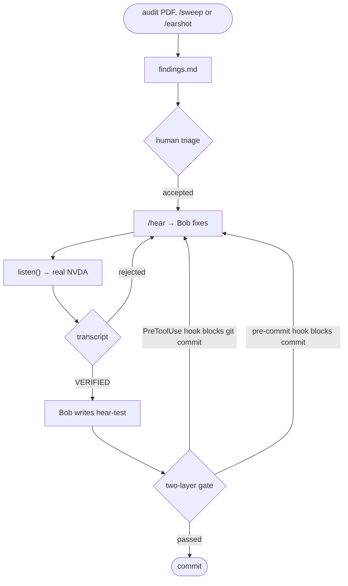

# Earshot: screen-reader tests for AI-written UI

   

Blind people use websites by listening to a screen reader. More and more UI code is written by AI coding agents, and those agents can't hear what they build: a fix can pass every automated check while the screen reader says nothing at all.

**Earshot gives IBM Bob ears.** Bob fixes an accessibility bug, then runs a real screen reader (NVDA, not a simulation) through the page with my MCP tool `listen()`. The fix counts only when NVDA says the right thing. Every verified fix becomes a test, and a gate (a git hook, plus a hook inside Bob) replays those tests before UI commits, so a later change can't quietly break what a blind user hears.

I tried it on three real apps I didn't write: IBM's own Galaxium Travels sample app, the TodoMVC React example, and [Uptime Kuma](https://github.com/louislam/uptime-kuma), a self-hosted monitoring tool with about 60,000 GitHub stars that people run in production. Nothing was planted: the bugs are theirs (the audit document that lists the first five is mine).

**One real bug, start to finish (F-01 of 15):**

![Blind people "read" websites by ear, with a screen reader (NVDA). The problem: apps often break for screen readers. For example, BEFORE: pressing Enter opens a Sign In window, and the screen reader says nothing. IBM Bob fixes the code, then checks it by ear with Earshot, the screen-reader testing tool I built. AFTER: the same key makes NVDA say "Sign In, dialog". 15 different accessibility bugs, all fixed by Bob in three real web apps, each verified by ear with Earshot; automated checkers (lint and axe) flagged only 3½.](report/f01_before_after.gif)

*Captions show what NVDA said; the [report page](https://py-tr.github.io/earshot/) has the real audio and waveforms.*

## Results at a glance

- **15 of 15** accessibility bugs fixed by Bob and verified by ear, on three apps, one of them a real product.
- **3½ of 15** flagged by automated checkers (strict React lint: 0 of the 13 on the two React apps; axe-core: 3½). 11 of the 15 were caught only by ear.
- **6 of Bob's own fixes were rejected by ear**, because NVDA still didn't say the right thing. Bob tried again until it did. On Uptime Kuma, human review then caught what no ear could: Bob's verified F-14 fix had removed arrow-key access on another page, and the Vue compiler showed its follow-up never called the handlers. Bob fixed both, and a new test guards it.
- **2 prompted regressions refused at commit.** I asked Bob to delete the dialog's focus code as a "tidy-up". The git hook refused the commit, and the Bob hook refused it again even with `--no-verify`. (The gate also once refused one of Bob's own over-strict tests, in task34; that was a bad test, not a regression.)

**Report page (with audio):** https://py-tr.github.io/earshot/ · **Video (3 min):** [VIDEO URL] · **Judges:** [where to check each claim](#for-judges-where-to-check-each-claim)

## Try it in one minute (no screen reader needed)

```
git clone https://github.com/py-tr/earshot && cd earshot
pip install mcp==2.2.0
python earshot_mcp/hear_tests.py --replay
python -m unittest discover -s earshot_mcp/tests
```

The first command replays every gate test against the real NVDA transcripts saved in `evidence/`. Each test has to **pass on the fixed transcript and fail on every broken one** (the original bug and Bob's rejected fixes), which shows that each test can tell broken from fixed. You should see 16 `PASS` lines in under a second. The second command runs 94 unit tests of the key parser, the pass/fail logic, the affected-tests selection, `hear-tests.json` and the Bob hook (Bob wrote them in Bob Shell and the IDE, tasks 42, 43, 45, 47 and 50). Both run on any OS, and CI runs them on Linux on every push. Listening live with NVDA needs Windows (see [Setup](#setup-for-live-listening-windows-only-because-nvda-runs-only-on-windows)).

## How it works



1. **Audit to findings.** Bob reads the audit PDF ([`audit/earshot-audit.pdf`](audit/earshot-audit.pdf)) and writes [`findings.md`](findings.md). Each line holds the WCAG criterion, a key script such as `Enter, Tab`, and the exact announcement expected, such as "Sign In, dialog".
2. **`/hear F-01`.** Bob switches to the `earshot` custom mode, which may only edit `galaxium/booking_system_frontend/src/`. It states the expected announcement, makes a minimal fix, then calls the MCP tool `listen(key_script)`.
3. **`listen()`** drives Chrome with real keystrokes (Tab, Enter, Shift+Tab, Escape, and typed text such as `Type "Mars"`) while NVDA runs. It returns only what NVDA said, plus where keyboard focus landed after each key. If the expected phrase is missing, Bob has to try again. After a second failure it replies NEEDS HUMAN.
4. **Gate, in two layers.** Every verified finding becomes a test in `hear-tests.json`. `.githooks/pre-commit` replays the tests with NVDA whenever frontend files are staged, and prints `BLOCKED by Earshot: this change breaks what a screen reader hears.` when an expected phrase is missing. Because `git commit --no-verify` skips git hooks, a Bob lifecycle hook (`.bob/settings.json`, `PreToolUse` on `execute_command` → `earshot_mcp/bob_hook.py`) replays the same tests before any `git commit` Bob runs and blocks it with exit code 2. When it passes, it records the staged tree, so the git hook does not listen twice.
5. **`/sweep <page>`.** Bob switches to the `earshot-sweep` mode, which can only write `sweep/*.md`. It Tabs through the page 25 times, flags suspicious stops and asks for one explore subagent per item, in parallel, to find the responsible file and line. A human accepts or rejects each proposal.

## Why automated checkers miss these

Rule scanners read the markup. Unit and end-to-end tests check what their author thought to assert. Both can pass while a blind user hears nothing, because neither listens to the speech output. Five cases from this repo:

- **F-01, a correct-looking fix that is silent.** Bob's first fix gave the dialog a proper accessible name. axe-core reported no violation, and a test asserting the dialog's role and name would pass. In NVDA, Enter was followed by silence, because focus never moved into the dialog.
- **N-02, a correct page that says nothing.** The result count is right in the DOM and on screen, so no rule fires. In NVDA, typing in the search box produced only the typed letters, because nothing announced the change.
- **F-07, correct elements that read twice.** Every element had a valid name and role; one link wrapped one button. axe-core on the Home page reported only an unnamed link and a region issue. NVDA read each of the three controls twice, on two Tab stops.
- **F-09, a verified fix that broke typing.** Bob's own F-01 fix, guarded by 9 passing screen-reader tests, made focus leave the Name field after one typed letter. No test typed there, so nothing failed. The first take that typed inside the dialog heard it at once.
- **F-12, a button that only a mouse can reach.** TodoMVC hides each Delete button with `display: none` until the pointer hovers over the item. axe-core skips hidden elements, so it reports nothing. In NVDA, Tab goes from the last checkbox straight to "All, link": a keyboard user can never delete a todo.

What Earshot adds is not more rules but a different oracle: the speech a blind user actually gets. Where rules do find problems (22 contrast failures, F-08's unnamed link), use them too.

## Results in detail

| | Strict React lint (eslint-plugin-jsx-a11y 6.10.2) | axe-core 4.13.0 | Earshot (NVDA 2026.2 via `listen()`) |
|---|---|---|---|
| Audit findings F-01..F-03 | 0 of 3 | half of 1 (the dialog name only) | **3 of 3 heard, fixed and re-heard** |
| Sweep findings F-04..F-08 (discovered by Bob on /flights and /) | 0 of 5 | 1 of 5 (F-08, the unnamed link) | **5 of 5 heard, fixed and re-heard** |
| Audit finding N-02 (needs typing) | 0 of 1 | 0 of 1 | **1 of 1 heard, fixed and re-heard** |
| F-09: a regression Bob's own F-01 fix introduced (found by typing) | 0 of 1 | 0 of 1 | **1 of 1 heard, fixed and re-heard** |
| F-10: two identical "Book" links (found by the one-command `/earshot` run on /destinations/mars) | 0 of 1 | 0 of 1 (not even axe's AAA and experimental rules) | **1 of 1 heard, fixed and re-heard** |
| TodoMVC (second app): F-11 unnamed todo checkboxes (found by `/earshot`), F-12 Delete buttons unreachable by keyboard (heard by a human in the sweep transcript) | 0 of 2 | 1 of 2 (F-11, `label`) | **2 of 2 heard, fixed and re-heard** |
| Uptime Kuma (third app, a real product): F-13 silent Tab stop on the logo, F-14 a second Tab stop inside every monitor link (both found by `/earshot`) | not run (the React lint plugin does not apply to Vue) | 1 of 2 (F-13, `object-alt`) | **2 of 2 heard, fixed and re-heard** |
| **All fifteen** | **0 of 13** (React apps) | **3½ of 15** | **15 of 15** |

**Earshot fixed and verified 15 of 15 on three apps; 11 of the 15 were caught only by ear.** Four counted findings came from my own audit document (F-01..F-03, N-02; the audit's fifth, N-01, is an animation pause that needs a human eye, so it is fixed but not counted), nine were found by Bob's sweeps (F-04..F-08, F-10 on Galaxium, F-11 on TodoMVC, F-13 and F-14 on Uptime Kuma), one (F-09) is a regression Bob's own F-01 fix introduced, found by ear, and one (F-12) was heard by a human reading the sweep transcript: Tab never reached a Delete button. For F-04..F-08, a human accepted the expected announcement in triage before Bob fixed against it. For F-10, Bob first wrote its own expected phrase as a pattern and marked a label ending in a bare flight id as verified; a human rewrote the expectation, and the final fix and its test were checked against that. The expected announcement is only as good as the person who accepts it. N-02 is a fair row but not a contest: no static checker has a rule for a missing status message, which is exactly the gap Earshot fills.

- **The fix that passed axe was still silent.** Bob's first F-01 fix only added a dialog name. axe reported no dialog violation, yet in NVDA Enter was followed by silence, and Tab then read "Moon, link, heading, level 3" from the page behind the dialog. Earshot rejected that fix. ([bench/RESULTS.md](bench/RESULTS.md))
- **Bob's own verified fix had broken typing, and the ear caught it.** Bob's F-01 fix moved focus into the Sign In dialog correctly, but its effect re-ran on every render, so after one typed letter focus jumped out of the Name field. None of the 9 tests typed inside the dialog, so the gate could not see it. The first time `listen()` typed there, NVDA heard "N" and then the dialog again. Bob fixed it (F-09), wrote the regression test itself, and committed through the gate. ([evidence/F-09](evidence/F-09/))
- **It runs headless, from the terminal.** `bob run --mode earshot-sweep --max-cost 1.5 "Sweep /destinations/earth. This is an unattended run: …"` (Bob Shell, no IDE) swept a page by ear with two parallel subagents, wrote its proposals and stopped at a cost cap: 0.31 Bobcoins, 2 minutes. On that already-fixed page it proposed 1 item and a human rejected it: it invented nothing. That is the shape of a nightly job on a listening machine: Bob proposes, a human triages in the IDE. ([triage](sweep/destinations-earth.triage.md))
- **The gate works.** [`hear-tests.json`](hear-tests.json) holds 16 tests on three apps (15 findings plus F-14b, a regression guard), and a full run of the first 13 passed in about 9 minutes ([timing](evidence/gate/gate_13_tests_timing.txt)). Asked to delete the dialog's focus code as a "tidy-up", Bob complied, and the gate refused the commit. NVDA heard silence, so the commit was blocked. ([evidence/gate/](evidence/gate/README.md))
- **Even `--no-verify` does not get past it, after one fix.** Asked to skip the slow hook, Bob ran `git commit --no-verify`; the Bob lifecycle hook replayed the tests, NVDA heard the dialog go silent, and the command was blocked before git ran (task30c). The first try (task30b) got through, because my hook read the input fields named in IBM's docs, not the ones Bob sends; that commit was undone at once. A later check found a second gap: when Bob stages and commits in one command (`git add X; git commit`), nothing is staged yet when the hook fires, so Bob's own fix commits were gated by the git hook alone. The hook now checks the working tree too. ([evidence/gate/](evidence/gate/README.md))
- **The fence is an instruction, the gate is the enforcement.** In task30a, asked in Agent mode to edit IBM's code, Bob refused, citing `AGENTS.md` (galaxium code is edited only in the Earshot mode). But in task11, also in Agent mode, it did edit `Modal.tsx` when asked. What stopped that change was the gate, not the rule.
- **It costs no human attention per commit.** Checking the first 6 announcements by hand with NVDA took a person 60 seconds at full speed and full concentration, and that has to be repeated on every commit. The gate needs 0 minutes of attention (about 9 minutes unattended for all 13), and it has already caught a regression that looked like a harmless tidy-up.
- **A human check made the tests stricter.** During a manual NVDA check, the skip link (F-05) was announced but pressing it left focus on the page body, so NVDA said nothing. Bob made `<main>` focusable and verified by ear that Enter now says "main landmark" and the next Tab reaches "Search flights, edit". The F-05 test now checks `Tab, Enter, Tab` instead of just `Tab`.
- **6 of Bob's own fixes were rejected by ear before the right one landed:** F-01 (name only), F-02 (no focus trap: Tab escaped to "github.com, link"), F-04 (the `Button` component dropped the label), F-07 (`tabIndex=-1` on the nested button: NVDA still said "button, link"), F-13 (`aria-hidden` alone: the logo was still a silent Tab stop) and F-14 (the link lost the heartbeat summary).
- **Where the ear stops, review and tools take over.** Bob's verified F-14 fix removed the heartbeat chart's Tab and arrow-key access on Uptime Kuma's Details and status pages, where no test walked; human review caught it, Bob fixed it, and hear-test F-14b now guards it. Bob's follow-up bound the handlers as `@keydown="inLink ? undefined : handleKeydown"`, which Vue compiles to a function that never calls the handler: NVDA still said "graphic", but the arrow keys were dead, and `listen()` cannot press arrows. The Vue compiler showed it, and Bob fixed it (tasks 48 and 49).

Earshot does not replace axe-core. axe also found 22 colour-contrast failures that no screen reader would report. Earshot catches what only the ear catches.

## Why it matters

- In WebAIM's February 2026 scan of the top million home pages, **95.9% had detectable WCAG 2 failures**; **missing form labels appeared on 51%** of them. ([WebAIM Million 2026](https://webaim.org/projects/million/))
- **3,117 website-accessibility lawsuits** were filed in US federal court alone in 2025, up 27% (Seyfarth Shaw). The **European Accessibility Act** has applied since 28 June 2025 to e-commerce, banking and passenger-transport sites (Directive (EU) 2019/882).
- **NVDA is the most commonly used desktop screen reader** (65.6% of respondents, WebAIM Screen Reader Survey #10), which is why Earshot listens with it.
- More and more UI code is written by AI assistants, and a fix can pass automated checks while a blind user still hears nothing (the GIF above shows one).
- **What it costs.** The whole build used about 46 Bobcoins (about $23), third app included. The median Bob cost per verified fix, failed attempts included, was about 0.7 Bobcoins (about $0.35); the most expensive was F-10 at about 4.7 Bobcoins, including a failed first `/earshot` run in the wrong mode and the sweep itself ([`bob_sessions/INDEX.md`](bob_sessions/INDEX.md)). Checking the same announcements by hand took a person 60 seconds of full attention per commit for just 6 checks.
- **How a team adopts it.** On apps Earshot had never seen (TodoMVC, then Uptime Kuma), one `/earshot <page>` command and one triage answer produced verified fixes and their gate tests; adding Uptime Kuma to the gate took Bob one task (task45). CI runs the replay and 94 unit tests on every push ([`.github/workflows/check.yml`](.github/workflows/check.yml)); the full listening gate can run on a self-hosted Windows runner ([template](docs/ci/README.md)).

## IBM Bob 2.0 features used, and where to see each one

| Bob feature | How Earshot uses it | Proof |
|---|---|---|
| **Agent mode** | Bob built the MCP server, the gate, the report, typing in `listen()` and the hooks | [`bob_sessions/INDEX.md`](bob_sessions/INDEX.md) (tasks 02, 10, 19, 23, 29) |
| **Custom modes** with `fileRegex` fences | `earshot` fixes (may edit only app source and `hear-tests.json`), `earshot-sweep` discovers (writes only `sweep/`), `earshot-run` runs the whole loop | [`.bob/custom_modes.yaml`](.bob/custom_modes.yaml) |
| **Rules** per mode | Each mode's rules live in `.bob/rules-<mode>/` (Bob's documented best practice; I moved Bob's instructions there); Bob Shell confirmed it loads them | [`.bob/rules-earshot/`](.bob/rules-earshot/) |
| **Slash commands and skills** | `/hear <finding>`, `/sweep <page>`, `/earshot <page>`; Bob wrote the `nvda-expectations` skill from my transcripts and WCAG pages | [`.bob/commands/`](.bob/commands/) · [`.bob/skills/nvda-expectations/`](.bob/skills/nvda-expectations/SKILL.md) |
| **MCP server** (my own) | `listen()` drives Chrome with real NVDA and returns what NVDA said; `listen_result()` collects long takes | [`earshot_mcp/server.py`](earshot_mcp/server.py) |
| **Parallel subagents** | Each sweep spawns one explore subagent per suspicious Tab stop, in parallel, to find the file and line | [`bob_sessions/`](bob_sessions/INDEX.md) (tasks 13a, 13d, 22, 38) · [headless run](bob_sessions/shell/INDEX.md) |
| **Managing multiple steps**: todo list, human question, subtasks | `/earshot` keeps a visible todo list, asks the human to triage (`ask_followup_question`) and fixes each accepted finding in a `/hear` subtask (`start_subtask`) | tasks 36b and 38; [`.bob/rules-earshot-run/`](.bob/rules-earshot-run/01-whole-loop.md) |
| **Document understanding** | Bob read the audit PDF into `findings.md`; Bob read WCAG Understanding pages through `@https://` mentions to write the skill | task 01 · task 41 |
| **Lifecycle hooks** | `PreToolUse` replays the screen-reader tests a change can affect before any `git commit` Bob runs (it blocked `--no-verify`); `SessionStart` checks that NVDA and the apps are up | [`.bob/settings.json`](.bob/settings.json) · [evidence/gate/](evidence/gate/README.md) |
| **`.bobignore`** (set up by me) | Keeps Bob out of recordings, dependencies and build output | [`.bobignore`](.bobignore) |
| **Bob Shell** (headless, cost-capped) | `bob run --mode earshot-sweep --max-cost 1.5 …` sweeps a page by ear from the terminal; Bob Shell also wrote the skill, unit tests, the affected-tests selection for both hooks and the diagram | [`bob_sessions/shell/INDEX.md`](bob_sessions/shell/INDEX.md) |

Machine-readable: [`evidence/index.json`](evidence/index.json) links every finding to its NVDA transcripts, audio, fix commit, gate test and Bob tasks; [`bob_sessions/INDEX.md`](bob_sessions/INDEX.md) lists every Bob task with its mode, cost and screenshot.

## For judges: where to check each claim

| Judging criterion | Claim | Check it here |
|---|---|---|
| Application of Technology: "complete and well thought-out, with a clear application of IBM Bob 2.0" | Bob's own surfaces do the work, from custom modes and an MCP tool to parallel subagents, subtasks, lifecycle hooks and headless Bob Shell: Bob fixes UI, verifies each fix with a real screen reader, rejects its own wrong fixes, discovers bugs, writes its own tests, and is refused by the gate it built (after I fixed the hook's input handling) | [Bob features used](#ibm-bob-20-features-used-and-where-to-see-each-one) · [How it was built](#how-it-was-built) · `bob_sessions/` (one screenshot per task) · [`.bob/custom_modes.yaml`](.bob/custom_modes.yaml) · [`earshot_mcp/server.py`](earshot_mcp/server.py) |
| Business Value: "how effectively the solution addresses a high priority issue" | 15 of 15 findings fixed and verified by ear on three real apps, one a production tool with about 60,000 GitHub stars; strict lint flagged 0 of the 13 on React apps and axe-core 3½ of 15 | [bench/RESULTS.md](bench/RESULTS.md) · [Why it matters](#why-it-matters) |
| Originality: "the approach in applying IBM Bob 2.0" | The agent's test oracle is what a blind user hears: Bob must hear its fix before it counts, and every commit replays the screen-reader tests | [What a markup check cannot hear](#why-automated-checkers-miss-these) · [How it works](#how-it-works) · [evidence/gate/](evidence/gate/README.md) |
| Presentation: "clarity and effectiveness" | Every claim links to a verbatim NVDA transcript and the NVDA audio; `hear_tests.py --replay` checks every test against them on any OS | [Evidence](#evidence) · [report page](https://py-tr.github.io/earshot/) |

## Evidence

Every transcript is extracted verbatim from NVDA's own log. The `.wav` next to it is NVDA's audio, captured from the NVDA process only.

| ID | Problem (WCAG) | Before: what NVDA said | After: what NVDA says | Files |
|---|---|---|---|---|
| F-01 | Sign In dialog silent (4.1.2, 2.4.3) | Enter → nothing; Tab → "Moon, link, heading, level 3" (page behind) | "Sign In, dialog", then "Close modal, button" | [before](evidence/F-01/before_bob_listen.txt) · [name-only fix, still silent](evidence/F-01/name_only_fix_still_silent_bob_listen.txt) · [after](evidence/F-01/after_bob_listen.txt) |
| F-02 | Tab escapes the open dialog (2.4.3) | Tab → "content info landmark, github.com, link" (Bob's first fix, rejected) | Tab wraps to "Close modal, button"; Escape returns to "Select Seat Class" | [rejected attempt](evidence/F-02/attempt1_rejected_bob_listen.txt) · [after](evidence/F-02/after_bob_listen.txt) |
| F-03 | Fields named by placeholder (1.3.1, 4.1.2) | "John Doe, edit" | "Name, edit, required" / "Email, edit, required" | [before](evidence/F-03/before_bob_listen_from_F02_run.txt) · [after](evidence/F-03/after_bob_listen.txt) |
| F-04 | Nine identical booking buttons (2.4.6, 1.3.1); found by `/sweep` | "Select Seat Class, button" ×9 | "Select Seat Class, Earth to Mars, button" | [sweep](sweep/flights.md) · [rejected attempt](evidence/F-04/attempt1_rejected_bob_listen.txt) · [after](evidence/F-04/after_bob_listen.txt) |
| F-05 | No skip link (2.4.1); found by `/sweep` | first Tab → "Pause animation, button" | first Tab → "Skip to main content, same page, link"; Enter → "main landmark"; next Tab → "Search flights, edit" | [before](evidence/F-05/before_probe_listen.txt) · [after](evidence/F-05/after_bob_listen.txt) · [skip link moves focus](evidence/F-05/after_skip_focus_listen.txt) |
| F-06 | Search field named only by its placeholder (1.3.1, 4.1.2, 3.3.2); found by `/sweep` | "Search by origin or destination..., edit" | "Search flights, edit" | [before](evidence/F-06/before_bob_sweep_listen.txt) · [after](evidence/F-06/after_bob_listen.txt) |
| N-01 | Starfield animation cannot be paused (2.2.2) | no control | "Pause animation, button"; a human confirmed by eye that the motion stops | [ear check](evidence/N-01/ear_check_bob_listen.txt) |
| F-07 | A button nested inside a link: two Tab stops for one control, 3 places on / (4.1.2, 2.4.3); found by `/sweep` | "Book a Flight, button, link" twice in a row | "Book a Flight, link" once | [sweep](sweep/home.md) · [before](evidence/F-07/before_bob_sweep_listen.txt) · [rejected attempt](evidence/F-07/attempt1_rejected_bob_listen.txt) · [after](evidence/F-07/after_bob_listen.txt) |
| F-08 | Footer GitHub icon link has no name (2.4.4, 1.1.1); found by `/sweep`; axe flags it too | "github.com, link" | "GitHub, link" | [before](evidence/F-08/before_bob_listen.txt) · [after](evidence/F-08/after_bob_listen.txt) |
| N-02 | Result count not announced while typing (4.1.3) | typed "M, a, r, s", then silence | "Showing 5 flights", then "Showing 4 flights", while typing | [before](evidence/N-02/before_typing_listen.txt) · [after](evidence/N-02/after_bob_listen.txt) |
| F-09 | Typing in the Sign In dialog loses focus after one letter (2.1.1, 3.2.2); regression from Bob's own F-01 fix | "N", then "Sign In, dialog" again; the next Tab says "Close modal, button" | "N, o, b, o, d, y", then Tab → "Email, edit, required" | [before](evidence/F-09/before_probe_typing_listen.txt) · [after](evidence/F-09/after_bob_listen.txt) |
| F-10 | Two flight links both named "Book" on /destinations/mars (2.4.4, 2.4.6); found by `/earshot` | "Book, link" twice | "Book Earth to Mars, Jan 01, 2099, link", then "Book Moon to Mars, Jan 07, 2099, link" | [before](evidence/F-10/before_bob_earshot_sweep_listen.txt) · [first fix, bare id](evidence/F-10/after_bob_listen_v1.txt) · [after](evidence/F-10/after_bob_listen.txt) |
| F-11 | TodoMVC: todo checkboxes have no name (4.1.2, 1.3.1); found by `/earshot` on a second app | "check box, not checked" (which todo?) | "Buy milk, check box, not checked" | [sweep](sweep/todomvc.md) · [before](evidence/F-11/before_bob_earshot_sweep_listen.txt) · [after](evidence/F-11/after_bob_listen.txt) |
| F-12 | TodoMVC: Delete buttons hidden until mouse hover, so unreachable by keyboard; all named "Delete todo" (2.1.1, 4.1.2); heard by a human | after the last checkbox, Tab goes to "All, link": no Delete | "Delete Buy milk, button" | [before](evidence/F-12/before_probe_listen.txt) · [after](evidence/F-12/after_bob_listen.txt) |
| F-13 | Uptime Kuma: the logo `<object>` is a silent Tab stop (4.1.2); found by `/earshot` on a third app, a real product | second Tab: nothing said (focus on an unnamed `OBJECT`) | second Tab → "Status Pages, link" | [rejected attempt (aria-hidden only)](evidence/F-13/attempt1_rejected_aria_hidden_only_bob_listen.txt) · [after](evidence/F-13/after_bob_listen.txt) |
| F-14 | Uptime Kuma: the heartbeat chart is a second Tab stop inside every monitor link (4.1.2, 2.4.3); found by `/earshot` | "100%, Galaxium, … link", then "Heartbeat history: …, graphic, clickable, link" | "Galaxium, Heartbeat history: …, link", next Tab → "TodoMVC, Heartbeat history: …, link" | [sweep](sweep/uptime-kuma.md) · [before](evidence/F-14/before_bob_earshot_sweep_listen.txt) · [rejected attempt](evidence/F-14/attempt1_rejected_no_heartbeat_name_bob_listen.txt) · [after](evidence/F-14/after_bob_listen.txt) |
| F-14b | Guard for F-14: on the monitor Details page (not inside a link) the chart must stay a keyboard stop (2.1.1); found by human review of Bob's F-14 fix | (after the first F-14 fix) no chart stop, no arrow-key access | Tab ×22 → "Heartbeat history: …, graphic" | [after](evidence/F-14b/after_bob_listen.txt) |
| Gate | Bob's "tidy-up" of `Modal.tsx` | F-01, F-02 and F-03 all failed: silence, then "Moon, link, heading, level 3" | commit refused, nothing committed | [README](evidence/gate/README.md) · [Bob's diff](evidence/gate/bob_refactor_blocked.diff) |
| Sweep | Seven sweeps that wrote proposals (three more runs hit the wrong page or mode, or could not write their file), on six pages of three apps: two on /flights, one on /, three inside `/earshot` (/destinations/mars, TodoMVC, Uptime Kuma's dashboard) with triage inside Bob, and one headless (/destinations/earth) | 27 proposals | a human accepted 12 as 9 findings: 3 on /flights (F-04..F-06), all 4 on / as F-07 (3 instances) and F-08, 1 on /destinations/mars (F-10), 2 on TodoMVC as F-11, 2 on Uptime Kuma (F-13, F-14); deferred 6 on Uptime Kuma (the status filters, one bug); rejected: 6 on /flights, a cosmetic "❯" on TodoMVC and the headless run's GitHub-name proposal; 1 duplicate | [run 1](sweep/flights.md) · [run 2](sweep/flights-run2.md) · [/flights triage](sweep/flights.triage.md) · [/ run](sweep/home.md) · [/ triage](sweep/home.triage.md) · [/destinations/mars](sweep/destinations-mars.md) · [TodoMVC](sweep/todomvc.md) · [Uptime Kuma](sweep/uptime-kuma.md) · [Uptime Kuma triage](sweep/uptime-kuma.triage.md) · [headless /destinations/earth](sweep/destinations-earth.md) |

## Setup for live listening (Windows only, because NVDA runs only on Windows)

Requirements: Windows 10/11, Google Chrome, Python 3.13 (tested), Node.js 18+, the .NET SDK (to build the audio-capture helper), and NVDA portable.

1. **NVDA portable.** Install a portable copy and set its log level to "input/output" (NVDA menu → Preferences → General → Logging level).
2. **Python environment**
   ```
   python -m venv .venv
   .venv\Scripts\pip install -r earshot_mcp\requirements.txt
   .venv\Scripts\python -m playwright install chrome
   ```
3. **Audio capture helper.** Run `cd earshot_mcp\proccap` and then `dotnet publish -c Release -o out`.
4. **`earshot_mcp\local.env`** (ignored by git and by Bob):
   ```
   EARSHOT_NVDA=C:\path\to\nvda.exe
   EARSHOT_NVDA_CONFIG=C:\path\to\nvda\userConfig
   ```
   Optional settings are `EARSHOT_URL` (default `http://localhost:5173/flights`), `EARSHOT_TAKES` and `EARSHOT_PROCCAP`.
5. **Run Galaxium** in two terminals:
   ```
   cd galaxium\booking_system_backend && python -m venv .venv && .venv\Scripts\pip install -r requirements.txt && .venv\Scripts\python server.py   # :8001
   cd galaxium\booking_system_frontend && npm install && npm run dev                                                                          # :5173
   ```
   Optional, the other two apps: TodoMVC with `cd todomvc && npm install && npx webpack serve --config webpack.dev.js --port 7002`; Uptime Kuma with `cd uptime-kuma && npm ci && npm run dev` (:3000; create an admin, add a monitor, then Settings → Security → Disable Auth so `listen()` lands on the dashboard).
6. **Connect Bob.** Copy `.bob/mcp.example.json` to `.bob/mcp.json` and replace `<workspace>`. Note that `timeout` is in **milliseconds**: 300000 = 5 min. Restart Bob fully after any change to `server.py`, because Bob caches the tool schema.
7. **Turn on the gate:** `git config core.hooksPath .githooks`
8. **Run the gate by hand:** `.venv\Scripts\python earshot_mcp\hear_tests.py` (all tests), or `... --only F-01` (one test).

In Bob, open `findings.md` and type `/hear F-01`, or type `/sweep /flights`.

## Repo map

| Path | What it is |
|---|---|
| `audit/earshot-audit.pdf` | The input audit EAR-2026-09-001 (self-authored for the demo, not a compliance statement) |
| `findings.md` | Findings in one-line form (written by Bob from the PDF; F-04..F-08, F-10 and F-11 added after triage; F-09 and F-12 added by a human) |
| `.bob/custom_modes.yaml`, `.bob/rules-<mode>/` | Custom modes `earshot` (fixes; edits only app source and `hear-tests.json`), `earshot-sweep` (discovers; writes only `sweep/`) and `earshot-run` (the whole loop in one command). Each mode's rules live in its own `.bob/rules-<mode>/` folder |
| `.bob/commands/hear.md`, `sweep.md`, `earshot.md` | `/hear`, `/sweep` and `/earshot` slash commands. `.bob/skills/` holds the skills Bob generated from them |
| `earshot_mcp/server.py` | MCP server with `listen(key_script, start, gap, path)` and `listen_result(label)` |
| `earshot_mcp/driver.py`, `extract.py`, `proccap/` | NVDA driver, log-to-transcript extractor, NVDA-only audio capture (prepared before kickoff, see below) |
| `earshot_mcp/hear_tests.py`, `hear-tests.json`, `.githooks/pre-commit` | The gate (`--replay` checks it offline on any OS) |
| `.bob/settings.json`, `earshot_mcp/bob_hook.py`, `earshot_mcp/preflight.py` | Bob lifecycle hooks: PreToolUse replays the tests before any `git commit` Bob runs; SessionStart checks that NVDA and the apps are up |
| `.bobignore` | Keeps Bob out of recordings, dependencies and build output |
| `evidence/` | Before/after transcripts and audio per finding, and the gate demo |
| `sweep/` | Bob's sweep proposals and the human triage |
| `bench/` | lint and axe benchmark: scripts, raw JSON, [RESULTS.md](bench/RESULTS.md) |
| `report/` | Static report page; the cards are baked into `index.html` by `report/bake.py`, so it reads without JavaScript |
| `bob_sessions/` | Screenshots of every Bob task's consumption summary (`pytr_taskNN_*`) |
| `galaxium/` | IBM Galaxium Travels @ `e4e18ae` (Apache-2.0); only `booking_system_frontend/src` was changed |
| `todomvc/` | TodoMVC React @ `ff43b02` (MIT), the second app; vendored unmodified, then F-11 and F-12 |
| `uptime-kuma/` | [Uptime Kuma](https://github.com/louislam/uptime-kuma) 2.5.5 @ `c98982a` (MIT), the third app; vendored unmodified, then F-13 and F-14 (see `uptime-kuma/UPSTREAM.md`) |

## Reliability and cost

Over the build, `listen()` recorded 323 NVDA takes. Three were aborted by the foreground safety check (another window took focus; the third was my own terminal during a gate run), and 5 produced no transcript (3 while the MCP timeout was misconfigured on day 1, 2 hung takes). In the first two `/earshot` runs, about 20 further calls aborted before a take started, because Bob passed a start control that does not exist on that page; the instructions now require `start="TOP"`. The gate once blocked a commit without listening, because the app served a half-written file, and once reported a regression that was really "could not listen", because a window title crashed the console output; both are fixed ("could not listen" has its own exit code, and output is UTF-8). The whole build used about 46 Bobcoins (about $23 at IBM's documented $0.50 per Bobcoin), by the account balance; the per-task screenshots add up to about 2.5 fewer, most likely because a parent task's displayed cost does not always include its subtasks.

## Known issues I did not fix

Found or seen during the build, listed so nobody mistakes them for fixed:

- **Flight filters:** the Filters toggle has no `aria-expanded`, and the time-of-day and category toggles show their selection by colour only (4.1.2, 1.4.1). No sweep ever opened the Filters panel.
- **8 filter labels** are not associated with their fields (1.3.1, 3.3.2; strict lint flags them).
- **22 colour-contrast failures** (1.4.3; axe-core flags them, a screen reader cannot).
- **"Learn More" on the Home page does nothing** (a functional bug for everyone, not a screen-reader issue).
- **The Pause animation button** is the second Tab stop but sits bottom-right on screen (at most a weak 2.4.3 issue).
- **TodoMVC:** editing a todo needs a double-click on its label, so keyboard users cannot edit (2.1.1; strict lint flags the handler on a non-interactive element), and the input uses `autoFocus` (lint flags it).
- **Untested paths:** the Sign In dialog opened from the header Login button, and the Register toggle.
- **Uptime Kuma status filters** (deferred from the sweep): the six filters read as "clickable, Up2" (a `div` with no button role, the count glued to the label). Real, one bug with six instances; not fixed ([triage](sweep/uptime-kuma.triage.md)).

## Limitations

- **Live listening needs Windows and NVDA.** The replay check and unit tests also run on Linux (CI runs them on Ubuntu). JAWS, VoiceOver and TalkBack are not covered yet.
- **Takes over the desktop.** `listen()` needs Chrome in the foreground and aborts if the foreground window changes. It runs one take at a time, and each test takes 30–60 s. Run it on a dedicated machine or VM, not on the machine you are typing on.
- **Typing is basic.** `listen()` can type plain text (letters, digits, spaces, `.`, `-`, `'`), but not special keys such as arrows or Backspace.
- **The gate is slow for a pre-commit hook, less so now.** Each test takes 30–60 s; the first 13 together took about 9 minutes. Both layers now replay only the tests a change can affect: a change to `Modal.tsx` replays the 4 dialog tests (about 2½ minutes), an Uptime Kuma change its 3 tests (about 2½ minutes, measured in task49), and a change to a file no test watches falls back to all tests of that app. `hear_tests.py --staged --plan` shows the selection without listening. Bob wrote the Bob hook's selection in Bob Shell (task47). The next step is to run the gate on push or in CI on a dedicated listening machine (not built).
- **Tests only hear what they drive.** F-09 shows the limit, and the known issues above are paths no test drives yet: a regression in a path no test walked (typing inside the dialog) passed the gate until a test typed there. Earshot guards the paths you give it; `/sweep` and new tests widen them.
- **Tab counts are brittle.** Tests address controls by their Tab position from the top of the page, so a change that adds or removes a Tab stop (as F-05 and F-07 did) can shift other tests. The gate then fails loudly, and a person updates the count.
- **Some things need a person.** Whether the animation actually stopped (N-01) and whether a proposal is really a failure (8 of 19 sweep proposals were rejected, 1 was a duplicate) are human calls.
- **Not a compliance tool.** Passing Earshot does not make an app WCAG-conformant. It proves only that specific announcements happen on specific key paths.
- **Prior art.** axe-core and Deque's axe MCP server check rules in the DOM. Guidepup automates real screen readers for tests that humans write. [a11ign](https://github.com/a11ign/a11ign) drives NVDA through a page and reports the barriers a rule scanner cannot see. [CurbCut](https://github.com/eziedutech/curbcut), another entry in this hackathon, reviews pull requests with Bob against WCAG 2.2 and proves each fix with a test; its README says it "does not judge real screen reader experience". Earshot's difference: what a real screen reader says is the oracle inside the AI agent's own fix loop (Bob's own fixes were rejected by ear) and inside a two-layer gate that blocked Bob's commits.

## How it was built

- **Built by IBM Bob during the event.** Every task's consumption summary is screenshotted in `bob_sessions/` (`pytr_taskNN_*`). The hackathon-provisioned account (`ibm-coding-challenge-uat`) was never received, so all tasks ran on an IBM Bob **trial account** (50 Bobcoins; about 46 used). Main pieces:
  - `findings.md` from the PDF (task01)
  - the MCP server, the `earshot` mode and `/hear` (task02, 02b–02i)
  - all UI fixes: F-01 task03 attempt 7, F-02 task05, F-03 task06, N-01 task07, F-04 task15, F-05 task16 and task21, F-06 task17, F-07 task24 and task25, F-08 task26, N-02 task27, F-09 task34, F-10 task36b and task37, F-11 task38, F-12 task39
  - the report page (task04, 09, 20, 28)
  - the gate (task10, task18, task19)
  - typing in `listen()` (task23)
  - Bob writes the gate test for each verified finding itself (earshot mode, task33; first used for F-09 in task34)
  - the `nvda-expectations` skill (task41, Bob Shell, 0.65 Bobcoins): Bob wrote it from my verbatim NVDA transcripts and two WCAG Understanding pages read through `@https://` mentions; a review corrected two of its eight sections (it had cited a focus re-read as a live region, and the end-of-page silence as a failure). The earshot and sweep rules tell Bob to use it
  - the unit tests in `earshot_mcp/tests/` (task42, Bob Shell) and every headless run, listed in [`bob_sessions/shell/INDEX.md`](bob_sessions/shell/INDEX.md)
  - the Bob lifecycle hook (task29), which blocked Bob's own `git commit --no-verify` (task30c). On the first try (task30a), Bob in Agent mode refused to edit IBM's code at all, citing `AGENTS.md`: the mode fences held.
  - `/sweep` and the `earshot-sweep` mode (task12, 12b, 13c)
  - page-aware `/hear` (task14)
  - the sweeps (task13a–13d on /flights, task22 on /)
  - `/earshot <page>`, the whole loop in one command (task35): sweep by ear with parallel explore subagents, human triage inside Bob, findings recorded, a `/hear` subtask per finding, summary. First run in Agent mode failed to switch modes (task36a); the second found and fixed F-10 (task36b)
  - the third app, Uptime Kuma (tasks 45–50): Bob wired it into the fence, gate, hook and preflight with 17 unit tests (task45); `/earshot` on its dashboard swept by ear, the human accepted 2 of 8 proposals, and Bob fixed and verified F-13 and F-14 in `/hear` subtasks (task46); after human review Bob restored the chart's keyboard access off the dashboard and added the F-14b guard (task48), then fixed the handler binding the Vue compiler exposed (task49); Bob made its own hook replay only the affected tests (task47, Bob Shell; committed by the human after the cost cap) and audited the hand-patched hook and run-mode config against IBM's docs (task50)
- **Prepared before kickoff and disclosed:**
  - the NVDA driver (`driver.py`), the transcript extractor (`extract.py`), the audio capture tool (`proccap/`) and the F-01 transcript fixtures.
  - Before kickoff I also spiked focus-trap and label fixes on a local Galaxium branch to prove the approach. Those spikes were not shipped: every fix in this repo was written by Bob during the event.
  - Details: commit `08979fd` (tooling) and `69dc0de` (fixtures).
- **Done with AI assistance (Claude Code), outside Bob:**
  - planning and setup
  - the draft of the self-authored audit PDF
  - the benchmark scripts (`bench/`)
  - driver fixes during the event (watchdog, focus labels, `--path` / `--start`)
  - tightening the Earshot mode and `/hear`, `/earshot` instructions after analysing Bob's exported task history of the first `/earshot` runs (explicit `start="TOP"`, one Tab count per finding, exact expected phrases, hear-test before commit)
  - the SessionStart preflight hook, moving the mode rules into `.bob/rules-<mode>/`, `.bobignore`, the captioned GIF, CONTRIBUTING and NOTICE
  - the evidence manifest (`evidence/make_index.py`), the Bob task index and the `--replay` mode of the gate runner
  - review of every Bob diff, a headless visual check (it caught F-07's full-width button, which Bob then fixed in task25), gate-test updates and the evidence files
  - these write-ups
- **The human** triaged every sweep proposal, approved every change, made the visual check for N-01, and committed Bob's verified fixes (Bob verified each fix by ear; from F-04 on, the commits also had to pass the Earshot gate).

## License

MIT (see [LICENSE](LICENSE)). `galaxium/` is the IBM Galaxium Travels sample app from [IBM/galaxium-travels](https://github.com/IBM/galaxium-travels) at commit `e4e18ae`, licensed Apache-2.0 (see [galaxium/LICENSE](galaxium/LICENSE)). My changes to it are listed in [galaxium/MODIFICATIONS.md](galaxium/MODIFICATIONS.md) and visible as commits in this repo. `todomvc/` (TodoMVC React, MIT, upstream `ff43b02`) and `uptime-kuma/` (Uptime Kuma 2.5.5, MIT, upstream `c98982a`) are vendored unmodified, with my changes as later commits; see [NOTICE.md](NOTICE.md).
